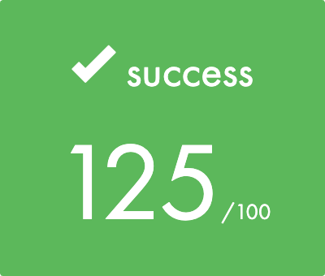

# # 42 Québec Cursus - Born2beroot

 

	

### À propos

Ce projet consiste à vous faire mettre en place votre premier serveur en suivant des règles spécifiques.

### Partie obligatoire et partie bonus

- [`PDF Sujet`](https://github.com/yanislabbe/born2beroot/blob/main/sujet.pdf)

## Auteur

- Yanis Labbé#
